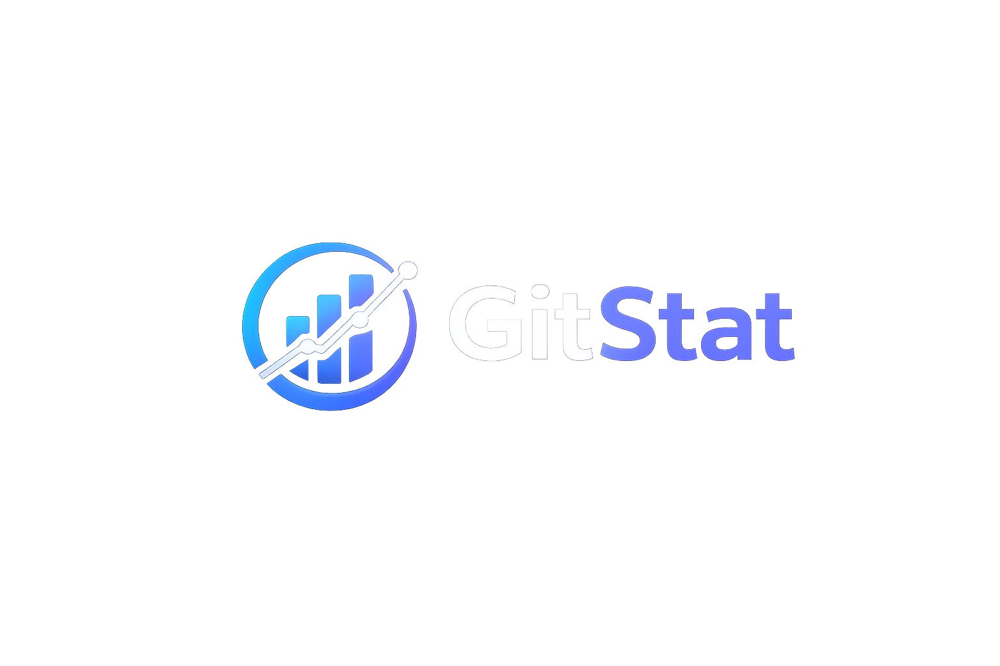
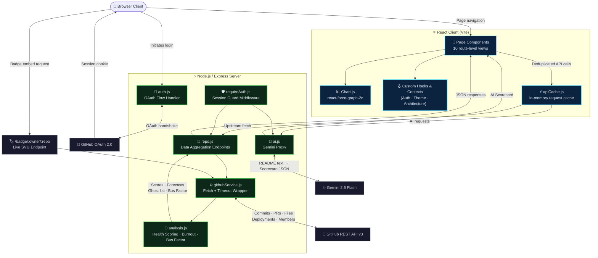

<p align="center">
  
</p>

<h1 align="center">GitStat</h1>

<p align="center">
  <strong>Understand who's building. Before they disappear.</strong>
</p>

<p align="center">
  An open-source GitHub contributor health dashboard that surfaces burnout signals, knowledge concentration risks, and contribution patterns — across any public or private repository, in real time, powered by the GitHub REST API and Google Gemini AI.
</p>

<p align="center">
  
  
  
  
  
</p>
---

## 📖 Table of Contents

1. [Introduction & Problem Statement](#-introduction--problem-statement)
2. [Key Features](#-key-features)
3. [System Architecture](#-system-architecture)
4. [Health Scoring Algorithm (Under the Hood)](#-health-scoring-algorithm-under-the-hood)
   - [Signal Weighting Model](#signal-weighting-model)
   - [Component Score Formulas](#component-score-formulas)
   - [Health Band Classification](#health-band-classification)
5. [Burnout Prediction Engine](#-burnout-prediction-engine)
6. [Bus Factor Analysis](#-bus-factor-analysis)
7. [API Route Reference](#-api-route-reference)
8. [Project Structure](#-project-structure)
9. [Local Development Setup](#-local-development-setup)
10. [Configuration & Environment Variables](#-configuration--environment-variables)
11. [Deployment Guide](#-deployment-guide)
12. [Contributing](#-contributing)

---

## 🌌 Introduction & Problem Statement

Engineering teams bleed contributors silently. A developer's commit velocity drops, their streak breaks, they start pushing at 2 AM — and by the time anyone notices, they've already mentally checked out. Existing GitHub analytics tools report history. GitStat predicts what comes next.

Open-source maintainers have no early warning system. They discover burnout after the fact, in the form of a quiet fork or an unmaintained dependency. For engineering leads inside organisations, the same blindspot costs months of onboarding when a load-bearing contributor leaves.

**GitStat** connects directly to the GitHub API, computes a composite health score for every active contributor, runs linear regression burnout forecasts, and surfaces knowledge concentration risks — all without requiring any code changes or integrations in the target repository. Analyse any public repo unauthenticated, or unlock private repos via GitHub OAuth.

---

## 🚀 Key Features

### Contributor Health Scoring
Every contributor receives a composite **Health Score (0–100)** calculated from five weighted signals: commit velocity, activity streak consistency, PR follow-through rate, response latency on pull requests, and an inverse off-hours ratio that acts as a burnout signal. Contributors are classified into four health bands: **At Risk · Stressed · Healthy · Thriving**.

---

### Burnout Prediction
GitStat runs **linear regression on the last 6 weeks** of commit activity for every active contributor. If the slope is consistently negative and the contributor is still active, GitStat projects exactly when they will go silent — and flags them before it happens.

- **Overview Page** — "Run Burnout Prediction" button with a live risk-count badge
- Per-contributor sparklines, weeks-to-fade estimate, and raw slope data
- **Time Machine slider** on the Contributors page replays metrics backwards up to 10 weeks

---

### Ghost Contributor Detector
Automatically identifies contributors who were active in the previous 8 weeks but have had **zero commits in the last 4 weeks** — the first signal of silent churn, caught before the contributor has officially disengaged.

---

### Bus Factor Heatmap
Analyses the last 10 commits per file across up to 40 files to compute **unique author counts per file**. Files with a single author are flagged as high risk. Aggregated into a single Bus Factor Score shown on the Overview KPI bar.

---

### AI README Scorecard (Gemini 2.5 Flash)
Sends the repository's README to Gemini AI and returns a structured **0–10 score** across six onboarding dimensions: Setup Guide · Contribution Guidelines · Code of Conduct · License · Contact · Purpose. Includes actionable, AI-generated improvement suggestions per dimension.

---

### Architecture Visualizer
Recursively maps the file tree (up to 500 files) and renders it in one of three adaptive modes based on repository size: collapsible file tree for small repos, categorised directory cards for medium repos, and a cluster map for large codebases. Includes automatic tech-stack detection across languages, frameworks, and tooling.

---

### Cross-Repo Network Graph
A **force-directed graph** (via `react-force-graph-2d`) that visualises contributor–repository connections across all repos analysed in the current session. Identifies **load-bearing contributors** — developers who span multiple projects and represent a single point of failure.

---

### Repo Compare
Side-by-side comparison of any two repositories across PR success rate, contributor count, velocity, total commits, and newbie-friendliness score. Search is debounced live against the GitHub API.

---

### Embeddable Health Badge
Each analysed repo gets a **dynamic SVG badge** hosted at `/badge/:owner/:repo` that reflects the live average contributor health score, embeddable in any README with a single line of Markdown.

---

## 🏗️ System Architecture

GitStat is structured as a two-tier system: a **Node.js/Express API server** that acts as an authenticated proxy to the GitHub REST API and Gemini AI, and a **React/Vite frontend** that drives all analysis, scoring, and visualisation.



---

## ⚙️ Health Scoring Algorithm (Under the Hood)

### Signal Weighting Model

The contributor Health Score is a weighted linear combination of five independent signal scores, each normalised to the range `[0, 100]`:

$$\text{Health Score} = (S_{\text{vel}} \times 0.28) + (S_{\text{streak}} \times 0.22) + (S_{\text{pr}} \times 0.18) + (S_{\text{latency}} \times 0.18) + (S_{\text{offhours}} \times 0.14)$$

| Signal | Weight | Source |
|:---|:---:|:---|
| Velocity Score $S_{\text{vel}}$ | 28% | Commit growth: recent 4 weeks vs prior 4 weeks |
| Streak Score $S_{\text{streak}}$ | 22% | Current active streak vs all-time peak streak |
| PR Score $S_{\text{pr}}$ | 18% | PRs merged ÷ PRs opened (follow-through rate) |
| Response Latency Score $S_{\text{latency}}$ | 18% | Inverse of average time-to-engage on open PRs |
| Off-Hours Score $S_{\text{offhours}}$ | 14% | Inverse late-night / weekend commit ratio |

---

### Component Score Formulas

**Velocity Score** — measures whether a contributor's output is accelerating or decelerating:

$$S_{\text{vel}} = \min\!\left(100,\ \frac{C_{\text{recent}}}{C_{\text{prior}} + 1} \times 50\right)$$

where $C_{\text{recent}}$ = commits in the last 4 weeks, $C_{\text{prior}}$ = commits in the 4 weeks before that. The `+1` guard prevents division by zero for new contributors.

**Streak Score** — rewards sustained, consistent activity:

$$S_{\text{streak}} = \min\!\left(100,\ \frac{\text{streak}_{\text{current}}}{\text{streak}_{\text{peak}} + 1} \times 100\right)$$

**PR Score** — measures delivery completion rate:

$$S_{\text{pr}} = \min\!\left(100,\ \frac{\text{PRs}_{\text{merged}}}{\text{PRs}_{\text{opened}} + 1} \times 100\right)$$

**Off-Hours Score** — acts as an inverse burnout signal. A contributor committing heavily at night or on weekends scores lower:

$$r_{\text{offhours}} = \frac{C_{\text{late-night}} + C_{\text{weekend}}}{C_{\text{total}} + 1}$$

$$S_{\text{offhours}} = \max\!\left(0,\ (1 - r_{\text{offhours}}) \times 100\right)$$

---

### Health Band Classification

| Band | Score Range | Interpretation |
|:---|:---:|:---|
| 🔴 At Risk | 0 – 40 | Declining velocity, broken streaks, or sustained off-hours activity |
| 🟠 Stressed | 41 – 65 | Stable but showing one or more early warning signals |
| 🟢 Healthy | 66 – 85 | Consistent output, good PR completion, normal working hours |
| 🟣 Thriving | 86 – 100 | Accelerating velocity, strong streaks, high engagement |

---

## 📉 Burnout Prediction Engine

The burnout forecaster runs **ordinary least-squares linear regression** over a rolling 6-week commit window for every active contributor. Let $x_i \in \{0, 1, 2, 3, 4, 5\}$ be the week index and $y_i$ be the commit count for that week.

The regression fits:

$$\hat{y} = mx + b$$

where the slope $m$ and intercept $b$ are derived from:

$$m = \frac{n \sum x_i y_i - \sum x_i \sum y_i}{n \sum x_i^2 - \left(\sum x_i\right)^2}, \quad b = \frac{\sum y_i - m \sum x_i}{n}$$

A contributor is **flagged at risk** when both conditions hold:
- Slope $m < 0$ (negative trend — output is declining)
- The contributor is still active (at least one commit in the most recent 2 weeks)

The projected **weeks-to-silence** is computed by finding the x-intercept of the regression line:

$$t_{\text{fade}} = -\frac{b}{m}$$

This value is surfaced as a countdown on each contributor card and in the burnout modal on the Overview page. Contributors with $t_{\text{fade}} \leq 3$ weeks are highlighted as **imminent risk**.

The Time Machine slider recomputes the regression using a shifted historical window, allowing leads to replay when a contributor began to decline.

---

## 🗂️ Bus Factor Analysis

The Bus Factor Heatmap evaluates **knowledge concentration risk** at file granularity. For each file $f$ in the analysed set (up to 40 files), GitStat fetches the last 10 commits that touched $f$ and counts the number of unique authors $A_f$.

Files are assigned a risk tier:

| Tier | Condition | Colour |
|:---|:---|:---:|
| 🔴 High Risk | $A_f = 1$ — one author owns this file entirely | Red |
| 🟡 Medium Risk | $A_f = 2$ — two authors, fragile shared ownership | Yellow |
| 🟢 Low Risk | $A_f \geq 3$ — distributed authorship | Green |

The aggregated **Bus Factor Score** is defined as:

$$\text{Bus Factor Score} = \frac{\text{Files with } A_f \geq 2}{\text{Total files analysed}} \times 100$$

A score of 100 means no file in the repository is a single-author dependency. This score is shown on the Overview page KPI bar alongside other repo-level health signals.

---

## 📡 API Route Reference

### Authentication (`auth.js`)

| Method | Route | Description | Response |
|:---|:---|:---|:---|
| **GET** | `/auth/github` | Redirects to GitHub OAuth authorisation page | `302 Redirect` |
| **GET** | `/auth/callback` | Handles OAuth callback, creates session cookie | `302 → /dashboard` |
| **GET** | `/auth/me` | Returns the currently authenticated user object | `UserSchema` |
| **GET** | `/auth/logout` | Destroys the server-side session | `200 OK` |

### Repository Data (`repo.js`)

| Method | Route | Description | Response |
|:---|:---|:---|:---|
| **GET** | `/api/repo/search` | Searches public repos via GitHub API (`?q=`) | `List[RepoSummary]` |
| **GET** | `/api/user/repos` | Lists the authenticated user's own repos | `List[RepoSummary]` |
| **GET** | `/api/repo/:owner/:repo/overview` | KPIs, health heatmap data, and ghost contributor list | `OverviewSchema` |
| **GET** | `/api/repo/:owner/:repo/contributors` | Per-contributor health scores and burnout forecasts | `List[ContributorSchema]` |
| **GET** | `/api/repo/:owner/:repo/commits` | Raw commit history with author and timestamp | `List[CommitSchema]` |
| **GET** | `/api/repo/:owner/:repo/pulls` | Pull request table with merge time and author | `List[PullSchema]` |
| **GET** | `/api/repo/:owner/:repo/deployments` | Deployment timeline with status, environment, and ref | `List[DeploymentSchema]` |
| **GET** | `/api/repo/:owner/:repo/files` | Recursive file tree for Architecture Visualizer | `FileTreeSchema` |
| **GET** | `/api/repo/:owner/:repo/compare` | Side-by-side comparison against a second repo | `CompareSchema` |
| **GET** | `/badge/:owner/:repo` | Returns a live dynamic SVG health badge | `image/svg+xml` |

### AI (`ai.js`)

| Method | Route | Description | Response |
|:---|:---|:---|:---|
| **POST** | `/api/ai/readme` | Sends README content to Gemini, returns structured scorecard | `ScorecardSchema` |

---

## 📂 Project Structure

```
GitStat/
├── client/
│   └── src/
│       ├── pages/                  # 10 route-level page components
│       │   ├── Landing.jsx         # Cinematic hero + GitHub OAuth entry
│       │   ├── Dashboard.jsx       # Repo search with match scoring
│       │   ├── YourRepos.jsx       # Authenticated user's repo list
│       │   ├── Overview.jsx        # KPIs, heatmap, burnout modal, AI score
│       │   ├── Contributors.jsx    # Cards, Time Machine, ghost detector
│       │   ├── DeepAnalysis.jsx    # Architecture visualizer + tech stack
│       │   ├── PullRequests.jsx    # Filterable PR table
│       │   ├── Deployments.jsx     # Deployment timeline
│       │   ├── Compare.jsx         # Side-by-side repo metrics
│       │   └── NetworkGraph.jsx    # Cross-repo force graph
│       ├── components/             # Shared UI components
│       │   ├── RepoLayout.jsx      # Persistent repo nav shell
│       │   ├── ContributorCard.jsx # Health score card with sparkline
│       │   ├── ChartDrawer.jsx     # Slide-out chart panel
│       │   └── Architecture/       # Tech stack detection, setup guide
│       ├── context/
│       │   ├── AuthContext.jsx     # GitHub session state
│       │   └── ThemeContext.jsx    # Dark / Light mode toggle
│       ├── hooks/
│       │   └── useRepoArchitecture.js
│       └── utils/
│           ├── metrics.js          # Health score + burnout regression
│           ├── matchScore.js       # Repo relevance matching
│           └── apiCache.js         # In-memory request deduplication
└── server/
    ├── routes/
    │   ├── auth.js                 # GitHub OAuth + session management
    │   ├── repo.js                 # All repository data endpoints
    │   └── ai.js                   # Gemini AI proxy
    ├── middleware/
    │   └── requireAuth.js          # Session guard for protected routes
    └── services/
        └── githubService.js        # GitHub API fetch with timeout + retry
```

---

## 💻 Local Development Setup

### Prerequisites

- **Node.js**: v18.0.0 or higher (check: `node -v`)
- A **GitHub OAuth App** (free) — [create one here](https://github.com/settings/developers)
- A **Gemini API key** (free) — [get one here](https://aistudio.google.com/app/apikey)

---

### 1. Clone the Repository

```bash
git clone https://github.com/malavya1411/GitStat.git
cd GitStat
```

---

### 2. Install Dependencies

```bash
# Root dependencies (concurrent dev runner)
npm install

# Client dependencies
cd client && npm install && cd ..

# Server dependencies
cd server && npm install && cd ..
```

---

### 3. Configure Environment Variables

Create `server/.env` from the template below:

```bash
cp server/.env.example server/.env
```

Then populate the values (see [Configuration & Environment Variables](#-configuration--environment-variables) for full reference).

---

### 4. Create a GitHub OAuth App

1. Go to [github.com/settings/developers](https://github.com/settings/developers) → **New OAuth App**
2. Set **Homepage URL** to `http://localhost:5173`
3. Set **Authorization callback URL** to `http://localhost:5001/auth/callback`
4. Copy the **Client ID** and a generated **Client Secret** into `server/.env`

---

### 5. Start the Development Servers

```bash
# From the root directory — starts both client and server concurrently
npm run dev
```

| Service | URL |
|:---|:---|
| Frontend (Vite) | `http://localhost:5173` |
| Backend (Express) | `http://localhost:5001` |

---

## 📋 Configuration & Environment Variables

### Backend (`server/.env`)

| Key | Type | Required | Description |
|:---|:---|:---:|:---|
| `GITHUB_CLIENT_ID` | String | ✅ | OAuth App Client ID from GitHub Developer Settings |
| `GITHUB_CLIENT_SECRET` | String | ✅ | OAuth App Client Secret from GitHub Developer Settings |
| `GEMINI_API_KEY` | String | ✅ | Google AI Studio API key for Gemini 2.5 Flash |
| `SESSION_SECRET` | String | ✅ | A long random string used to sign session cookies |
| `PORT` | Integer | — | Express server port. Defaults to `5001` |
| `FRONTEND_URL` | String | — | Frontend origin for CORS. Defaults to `http://localhost:5173` |
| `NODE_ENV` | String | — | Set to `production` for production deployments |

### Frontend (`client/.env.local`)

| Key | Type | Default | Description |
|:---|:---|:---|:---|
| `VITE_API_BASE_URL` | String | `http://localhost:5001` | Express backend origin for all API calls |

---

## 🌐 Deployment Guide

### Backend (Recommended: Render)

1. Create a new **Web Service** pointing to your GitHub repository.
2. Set the **Root Directory** to `server`.
3. Set **Build Command** to `npm install` and **Start Command** to `node index.js` (or `npm start`).
4. Add the environment variables (`GITHUB_CLIENT_ID`, `GITHUB_CLIENT_SECRET`, `GEMINI_API_KEY`, `SESSION_SECRET`, `FRONTEND_URL`) in the Render dashboard.
5. Update your GitHub OAuth App's **Authorization callback URL** to `https://your-render-url.onrender.com/auth/callback`.

### Frontend (Recommended: Vercel)

1. Import the repository in the Vercel dashboard.
2. Set the **Root Directory** to `client`.
3. Set the **Framework Preset** to `Vite`.
4. Add `VITE_API_BASE_URL` pointing to your live Render backend URL.
5. Deploy. Vercel will handle SPA routing automatically via `vercel.json` rewrites.

---

## 🤝 Contributing

Contributions are welcome. A few notes before opening a PR:

- **Health score or burnout logic changes** — review the weighting table in `server/utils/analysis.js` and the formula documentation above before modifying. Open an issue first to discuss changes to the scoring model; these affect every contributor card, the overview KPI bar, and the embeddable badge.
- **New data endpoints** — add the route in `server/routes/repo.js`, wrap it with `requireAuth` where appropriate, and add a corresponding entry to the API Route Reference table in this README.
- **Frontend-only features** — keep data transformation logic in `client/src/utils/metrics.js`, not inside page components.

Bug reports and feature requests are welcome via [GitHub Issues](https://github.com/malavya1411/GitStat/issues).

## 📄 License

MIT — GitStat is fully open source. You are free to use, modify, and distribute it.
